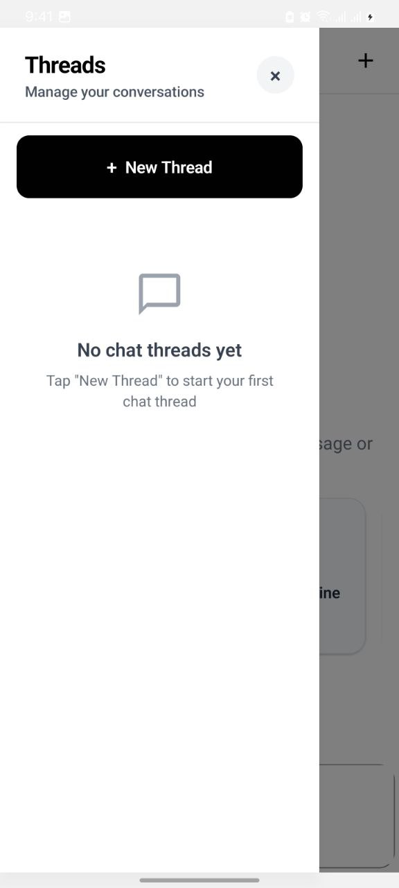
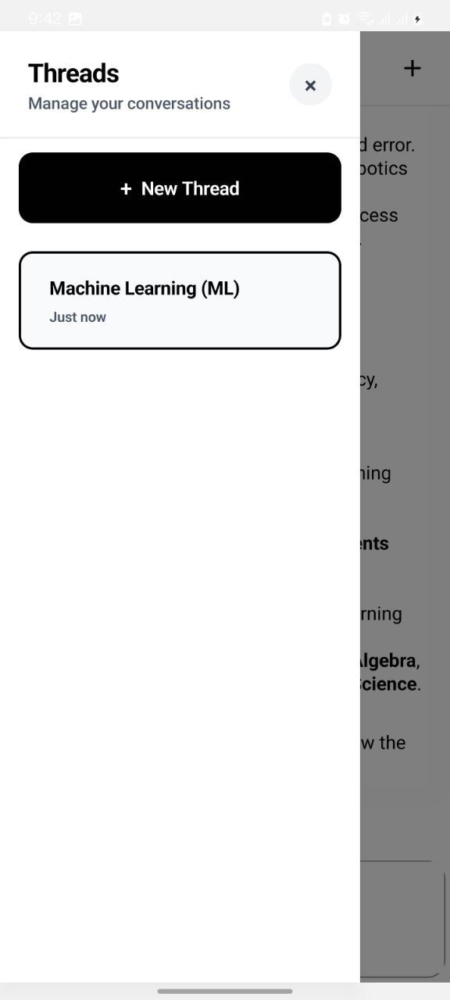

# 🚧 This library is under construction! 🛠️

# 📅 It will be ready by October 15, 2025 🚀

# 🤖 React Native Ajora

<div align="center">

**The most complete AI agent UI for React Native**

[](https://badge.fury.io/js/react-native-ajora)
[](https://opensource.org/licenses/MIT)
[](https://www.typescriptlang.org/)
[](https://reactnative.dev/)

_Build beautiful, intelligent chat interfaces with AI agents in React Native_

</div>

---

## ✨ Features

- 🎨 **Beautiful UI Components** - Pre-built, customizable chat components with modern design
- 🧠 **AI Agent Ready** - Built specifically for AI agent interactions with streaming responses
- 📱 **Cross-Platform** - Works on iOS, Android, and Web with React Native
- 🎯 **TypeScript Support** - Full TypeScript definitions for all components and props
- 🔧 **Highly Customizable** - Extensive prop system and render functions for complete customization
- 💬 **Rich Media Support** - Native support for images, audio, files with lightbox viewing
- 🧵 **Thread Management** - Multi-conversation support with persistent thread history
- ⌨️ **Smart Keyboard** - Intelligent keyboard handling with React Native Keyboard Controller
- 🎭 **Smooth Animations** - Native animations powered by React Native Reanimated 3
- 🔌 **Built-in AI Tools** - Native tools including todo lists, web search, document search, and confirmations
- 📊 **Thinking Indicators** - Beautiful animated thinking indicators for AI processing states
- 🔄 **Function Calling** - Full support for AI function calls with custom tool UI integration
- 🎛️ **Server/Client Tools** - Support for both server-executed and client-side interactive tools
- 💭 **Thought Rendering** - Display AI internal thoughts and reasoning process
- 🔄 **Message Streaming** - Real-time streaming message updates via Server-Sent Events
- 🎨 **Action Sheets** - Built-in action sheet support for message interactions

## 🚀 Quick Start

### Installation

```bash
npm install react-native-ajora
# or
yarn add react-native-ajora
```

### Peer Dependencies

Make sure you have these peer dependencies installed:

```bash
npm install @expo/vector-icons @expo/react-native-action-sheet @gorhom/bottom-sheet react-native-keyboard-controller react-native-reanimated react-native-lightbox-v2 dayjs uuid react-native-safe-area-context
```

### Basic Usage

```tsx
import React from "react";
import { SafeAreaView } from "react-native-safe-area-context";
import { Ajora, AjoraProvider } from "react-native-ajora";

const App = () => {
  return (
    <AjoraProvider
      baseUrl="http://localhost:3000" // Your backend server URL
      bearerToken="your-auth-token" // Optional authentication token
      debug={true} // Optional debug mode
    >
      <SafeAreaView style={{ flex: 1 }}>
        <Ajora
          showHeader={true}
          showThreads={true}
          isScrollToBottomEnabled={true}
          keyboardShouldPersistTaps="never"
          infiniteScroll={true}
          onSend={(messages) => {
            console.log("New messages:", messages);
          }}
        />
      </SafeAreaView>
    </AjoraProvider>
  );
};

export default App;
```

## 📖 Documentation

### Core Components

#### Ajora

The main chat component that orchestrates all other components.

```tsx
<Ajora
  messages={messages}
  onSend={handleSend}
  isThinking={isThinking}
  showHeader={true}
  showThreads={true}
  renderTools={() => [TimeTool, WeatherTool]}
/>
```

#### Message Types

```tsx
interface IMessage {
  _id: string;
  thread_id: string;
  role: "user" | "model";
  parts: Part[];
  created_at?: string;
  updated_at?: string;
}

interface Part {
  thought?: boolean; // Mark as AI internal thought
  functionCall?: FunctionCall; // AI tool/function call
  functionResponse?: FunctionResponse; // Tool response
  text?: string; // Text content
  audio?: {
    uri: string;
    name: string;
    size?: number;
    mimeType?: string;
  };
  image?: string; // Image URL or base64
  file?: {
    uri: string;
    name: string;
    size?: number;
    mimeType?: string;
  };
}

interface FunctionCall {
  id?: string;
  args?: Record<string, unknown>;
  name?: string;
  response?: any; // Merged response data
}

interface FunctionResponse {
  id?: string;
  name?: string;
  response?: Record<string, unknown>;
}
```

### Advanced Features

#### Thread Management

```tsx
import { Thread } from "react-native-ajora";

<Ajora
  showHeader={true}
  showThreads={true}
  onThreadSelect={(thread: Thread) => {
    console.log("Selected thread:", thread);
    // Thread switching is handled automatically
  }}
  onNewThread={() => {
    console.log("Creating new thread");
    // New thread creation is handled automatically
  }}
  onHeaderMenuPress={() => {
    // Custom header menu action (opens thread drawer by default)
  }}
  onHeaderPlusPress={() => {
    // Custom plus button action (creates new thread by default)
  }}
/>
```

#### Built-in AI Tools

The library includes several native tools that work out of the box:

```tsx
// These tools are automatically available:
// - todo_list: Interactive todo list management
// - confirm_action: User confirmation dialogs
// - search_web: Web search functionality
// - search_document: Document search capabilities

// The AI can use these tools automatically in function calls
```

#### Custom Tools Integration

```tsx
// Create custom tool UI components
const CustomTimeTool = ({ request, submitQuery, onResponse }) => {
  const { tool } = request;
  const { timezone } = tool.args || {};
  
  return (
    <View>
      <Text>Getting time for: {timezone}</Text>
      {/* Your custom tool UI */}
    </View>
  );
};

<Ajora
  tools={() => [
    <CustomTimeTool key="get_current_time" toolName="get_current_time" />
  ]}
/>
```

#### Custom Styling

```tsx
<Ajora
  messagesContainerStyle={{
    backgroundColor: "#f0f0f0",
  }}
  renderBubble={(props) => <CustomBubble {...props} />}
  renderInputToolbar={(props) => <CustomInputToolbar {...props} />}
  renderMessage={(props) => <CustomMessage {...props} />}
  renderMessageText={(props) => <CustomMessageText {...props} />}
  renderHeader={(props) => <CustomHeader {...props} />}
  renderThread={(props) => <CustomThread {...props} />}
  renderMessageActions={(props) => <CustomMessageActions {...props} />}
/>
```

#### Using the Hook Directly

For advanced use cases, you can use the `useAjora` hook directly:

```tsx
import { useAjora } from "react-native-ajora";

const MyCustomChat = () => {
  const ajora = useAjora({
    baseUrl: "http://localhost:3000",
    bearerToken: "your-token",
    debug: true,
  });

  const {
    messagesByThread,
    threads,
    activeThreadId,
    isThinking,
    submitQuery,
    addNewThread,
    switchThread,
    stopStreaming,
    regenerateMessage,
  } = ajora;

  return (
    // Your custom chat UI
  );
};
```

#### Server Integration

The library expects a server that handles AI agent interactions:

```tsx
// Server endpoints expected:
// GET /api/threads - Get user's conversation threads
// POST /api/threads - Create new thread
// GET /api/threads/:id/messages - Get messages for thread
// POST /api/chat - Send message and stream AI response (SSE)

// Example message format for API:
const userMessage = {
  type: "text", // or "regenerate"
  message: {
    _id: "unique-id",
    thread_id: "thread-id",
    role: "user",
    parts: [{ text: "Hello!" }],
    created_at: new Date().toISOString(),
  },
  mode: "assistant" // or "agent"
};
```

## 🎨 Screenshots

<div align="center">


_Beautiful chat interface with AI agent_


_Multi-thread conversation management_


_Advanced AI agent features and tools_


_Customizable interface and theming_

</div>

## 🔧 Configuration

### Provider Setup

```tsx
import { AjoraProvider } from "react-native-ajora";

<AjoraProvider
  baseUrl="https://your-ai-server.com"
  bearerToken="your-auth-token"
  debug={false}
  initialMessages={{}} // Pre-populate messages
  initialThreads={[]} // Pre-populate threads
>
  <YourApp />
</AjoraProvider>
```

### Core Chat Props

```tsx
<Ajora
  // Thread & Header Management
  showHeader={true}
  showThreads={true}
  headerProps={{ title: "AI Assistant" }}
  threadProps={{ containerStyle: {} }}
  
  // Message Display
  isScrollToBottomEnabled={true}
  infiniteScroll={true}
  loadEarlier={false}
  alignTop={false}
  
  // Input Configuration
  placeholder="Ask me anything..."
  disableComposer={false}
  maxInputLength={2000}
  minComposerHeight={44}
  maxComposerHeight={120}
  alwaysShowSend={false}
  
  // Media & Interaction
  showUserAvatar={false}
  showAvatarForEveryMessage={false}
  renderAvatarOnTop={false}
  isCustomViewBottom={false}
/>
```

### Keyboard Handling

```tsx
<Ajora
  keyboardShouldPersistTaps="never" // "always" | "never" | "handled"
  focusOnInputWhenOpeningKeyboard={true}
  isKeyboardInternallyHandled={true}
  bottomOffset={0} // Distance from screen bottom
/>
```

### Event Callbacks

```tsx
<Ajora
  onSend={(messages) => console.log("Sent:", messages)}
  onLoadEarlier={() => console.log("Loading earlier messages")}
  onPress={(context, message) => console.log("Message pressed")}
  onLongPress={(context, message) => console.log("Message long pressed")}
  onInputTextChanged={(text) => console.log("Input changed:", text)}
  onPressActionButton={() => console.log("Action button pressed")}
/>
```

## 🛠️ Development

### Prerequisites

- Node.js >= 18
- React Native development environment
- Expo CLI (for example app)

### Setup

1. Clone the repository:

```bash
git clone https://github.com/habasefa/react-native-ajora.git
cd react-native-ajora
```

2. Install dependencies:

```bash
npm install
```

3. Start the example app:

```bash
npm start
```

### Building

```bash
npm run build
```

### Testing

```bash
npm test
npm run test:coverage
```

## 📚 Examples

Check out the included example applications:

### Example App (`example-app/`)
- **Complete Expo App** - Full React Native app with Ajora integration
- **Native Tools Demo** - Showcases built-in AI tools (todo, search, confirm)
- **Thread Management** - Multi-conversation interface
- **Custom Styling** - Themed components and layouts
- **Media Support** - Image, audio, and file message examples

### Example Server (`example-server/`)
- **Node.js Backend** - Complete server implementation for AI agents
- **Gemini AI Integration** - Example using Google's Gemini AI
- **Tool Execution** - Server-side tool handling
- **SSE Streaming** - Real-time message streaming
- **Database Integration** - Message and thread persistence

To run the examples:

```bash
# Install dependencies
npm install

# Start the example server
cd example-server
npm install && npm start

# In another terminal, start the example app
cd example-app
npm install && npm start
```

## 🤝 Contributing

We welcome contributions! Please see our [Contributing Guide](CONTRIBUTING.md) for details.

1. Fork the repository
2. Create your feature branch (`git checkout -b feature/amazing-feature`)
3. Commit your changes (`git commit -m 'Add some amazing feature'`)
4. Push to the branch (`git push origin feature/amazing-feature`)
5. Open a Pull Request

## 📄 License

This project is licensed under the MIT License - see the [LICENSE](LICENSE) file for details.

## 📋 API Reference

### Key Exports

```tsx
// Main Components
import { 
  Ajora,           // Main chat component
  AjoraProvider,   // Context provider
  useAjora,        // State management hook
} from "react-native-ajora";

// UI Components
import {
  Actions,         // Action button component
  Bubble,          // Message bubble component
  Composer,        // Text input component
  InputToolbar,    // Input toolbar container
  LoadEarlier,     // Load earlier button
  Message,         // Individual message component
  MessageContainer,// Messages list container
  MessageImage,    // Image message component
  MessageText,     // Text message component
  Send,            // Send button component
} from "react-native-ajora";

// Types
import type {
  IMessage,        // Core message interface
  Part,            // Message part interface
  FunctionCall,    // Function call interface
  FunctionResponse,// Function response interface
  Thread,          // Thread interface
  AjoraProps,      // Main component props
  AjoraState,      // Hook state type
} from "react-native-ajora";
```

### Native Tools

```tsx
// Built-in tools available to AI agents:
- "todo_list"      // Interactive todo list management
- "confirm_action" // User confirmation dialogs  
- "search_web"     // Web search functionality
- "search_document"// Document search capabilities
```

## 🙏 Acknowledgments

- Built with ❤️ for the React Native community
- Inspired by modern chat interfaces and AI agent UIs
- Special thanks to Farid and [react-native-giftedchat](https://github.com/FaridSafi/react-native-gifted-chat) contributors
- Powered by React Native Reanimated, Expo Vector Icons, and other amazing open source libraries

## 📞 Support

- 📧 Email: [nazrihabtish@gmail.com](mailto:nazrihabtish@gmail.com)
- 🐛 Issues: [GitHub Issues](https://github.com/habasefa/react-native-ajora/issues)
- 💬 Discussions: [GitHub Discussions](https://github.com/habasefa/react-native-ajora/discussions)

---

<div align="center">

**Made with ❤️ by [Habtamu Asefa](https://github.com/habasefa)**

[⭐ Star us on GitHub](https://github.com/habasefa/react-native-ajora) • [📖 Documentation](https://github.com/habasefa/react-native-ajora#readme) • [🐛 Report Bug](https://github.com/habasefa/react-native-ajora/issues) • [✨ Request Feature](https://github.com/habasefa/react-native-ajora/issues)

</div>
